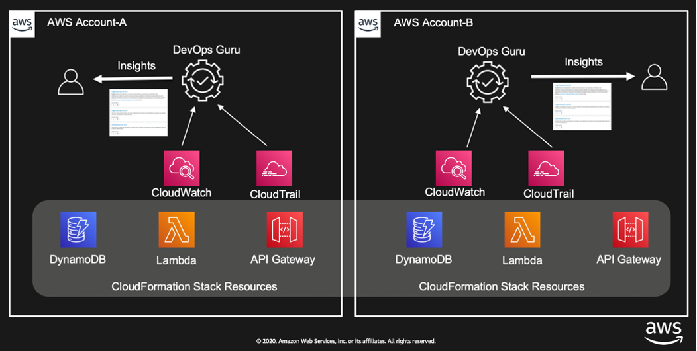
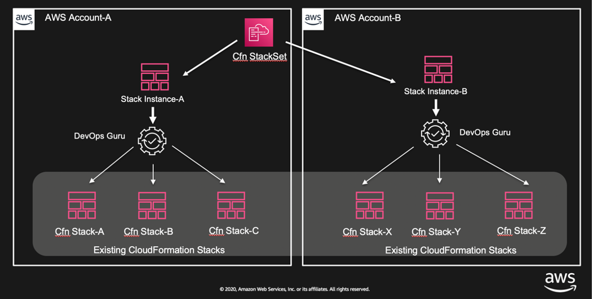

## Amazon DevOps Guru Samples

Amazon DevOps Guru is a machine learning (ML) powered service that gives you a simpler way to improve an application’s availability and reduce expensive downtime. Without involving any complex configuration setup, DevOps Guru automatically ingests operational data in your AWS cloud. When DevOps Guru identifies a critical issue, it automatically alerts you with a summary of related anomalies, the likely root cause, and context on when and where the issue occurred. DevOps Guru also, when possible, provides prescriptive recommendations on how to remediate the issue.

## Configuring DevOps Guru

To get started, you need to configure DevOps Guru and specify which AWS resources to analyze. If your applications are distributed across multiple AWS accounts and AWS regions, you need to configure DevOps Guru for each account-region combination. Though this may sound complex, it is infact very simple to do so using AWS CloudFormation StackSets. 

Check out this blog post with detailed instructions: 

[Easily configure Amazon DevOps Guru across multiple accounts and Regions using AWS CloudFormation StackSets](https://aws.amazon.com/blogs/devops/configure-devops-guru-multiple-accounts-regions-using-cfn-stacksets/)

## Interested in Contributing?

See [CONTRIBUTING](CONTRIBUTING.md#security-issue-notifications) for more information.

## License

This library is licensed under the MIT-0 License. See the [LICENSE](/LICENSE) file.

